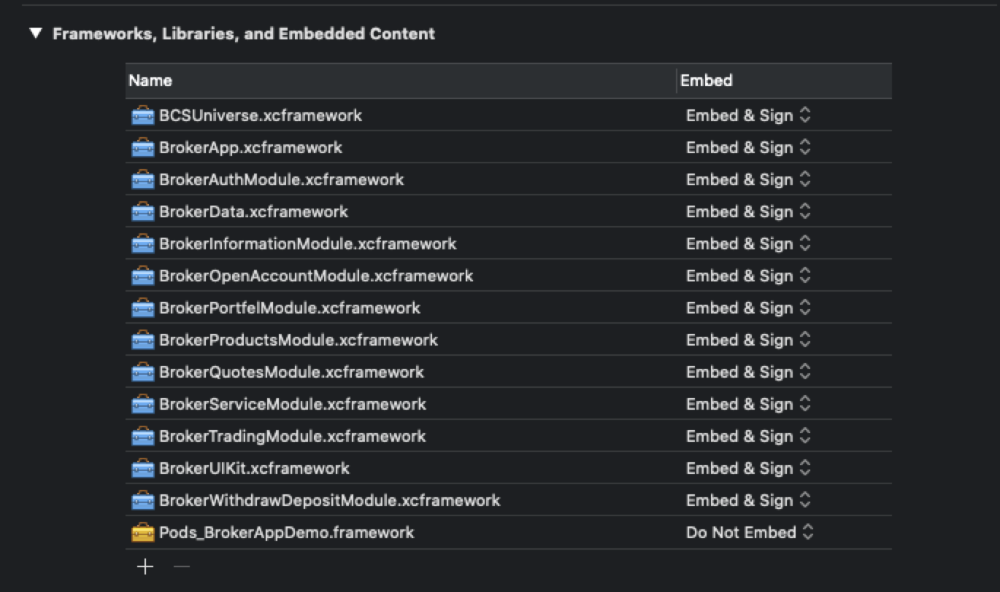

 BrokerSDK. BrokerApp
======================================
## Требования

* Xcode 11.3
* Swift 5.0
* iOS 11.0

## Установка 
Библиотека поставляется как xcframework.  Установить можно как в ручную (в этом случае придется самостоятельно установить все зависимые библиотеки) либо используя [CocoaPods](https://guides.cocoapods.org/using/using-cocoapods.html).

Поддержка xcframework в CocoaPods добавлена в версии [1.9.0](http://blog.cocoapods.org/CocoaPods-1.9.0-beta/).

На момент написания актуальная версия 1.9.0.beta.2. 

Чтобы обновить CocoaPods, выполните в терминале: 
```bash
sudo gem install cocoapods --pre
```

### Podfile

```ruby
# Podfile
platform :ios, '11.0'
use_frameworks!
inhibit_all_warnings!

target 'YOUR_TARGET_NAME' do
   pod 'BrokerApp', '~> 1.0.0' 
end
 
```

Замените `YOUR_TARGET_NAME` и после в директории `Podfile` выполнить:

```bash
$ pod install
```
После этого необходимо для вашего таргета добавить установленные binary фреймворки ( `General -> Frameworks, Libraries, and Embedded Content`)



